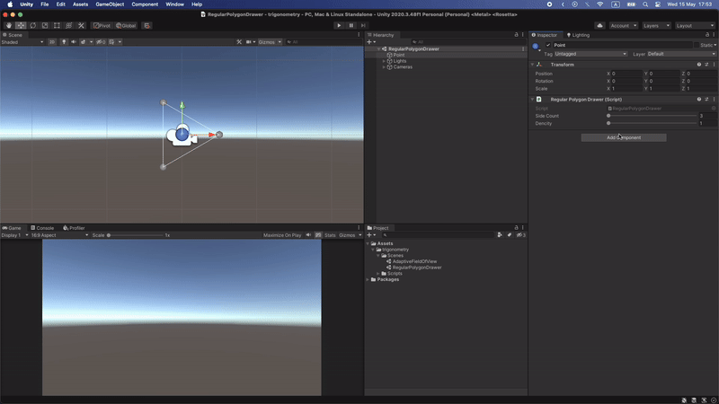
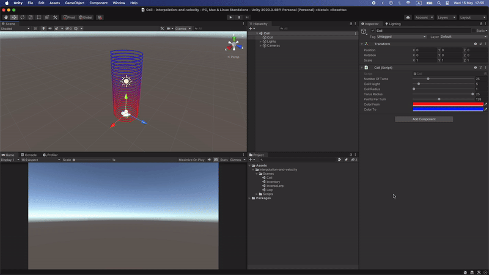
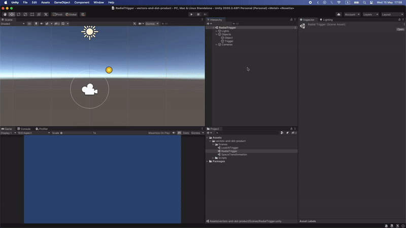
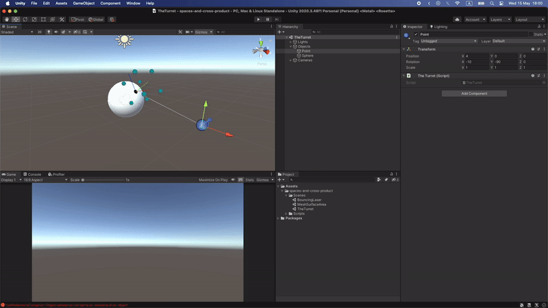

# Unity Math for Game Developers

Welcome to the "unity-math-for-game-devs" repository! This collection of examples demonstrates various math concepts used in game development. The content in this repository is based on tutorials and instructions from [Acegikmo's YouTube Channel](https://www.youtube.com/@Acegikmo/videos) and created by [Davit Badalyan](https://github.com/davit-badalyan).

## Table of Contents

- [About](#about)
- [Examples](#examples)
- [Getting Started](#getting-started)
- [Preview](#preview)
- [License](#license)

## <a name="about"></a> About

This repository serves as a practical guide to understanding and implementing essential mathematical concepts commonly used in game development. The examples provided are based on tutorials and instructions from [Acegikmo's YouTube Channel](https://www.youtube.com/@Acegikmo/videos).

## <a name="examples"></a> Examples

Explore a variety of math concepts through the following examples.

Feel free to delve into each example folder for detailed information.

**Note:** These examples were developed using Unity 2021 LTS.

## <a name="getting-started"></a> Getting Started

To dive into the examples and learn more about the mathematical concepts used in game development, follow these simple steps:

1. **Clone the Repository**
   ```bash
   git clone https://github.com/your-digital-research/unity-math-for-game-devs.git
2. **Navigate to the Desired Example**
3. **Open in Unity**
   - Launch the Unity editor and open the example folder.
   - Explore and modify the examples as needed.
4. **Run the Example**
   - Test and run the example within the Unity editor.

## <a name="preview"></a> Preview

<p align="center">
  
</p>

<p align="center">
  
</p>

<p align="center">
  
</p>

<p align="center">
  
</p>

## <a name="license"></a> License

This repository is licensed under the [MIT License](https://opensource.org/license/mit/). Feel free to leverage and adapt the examples for your own projects.

If you have any questions, encounter issues, or wish to share suggestions, please open an issue.

Happy coding!
